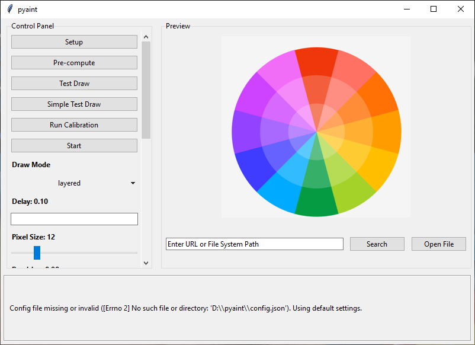
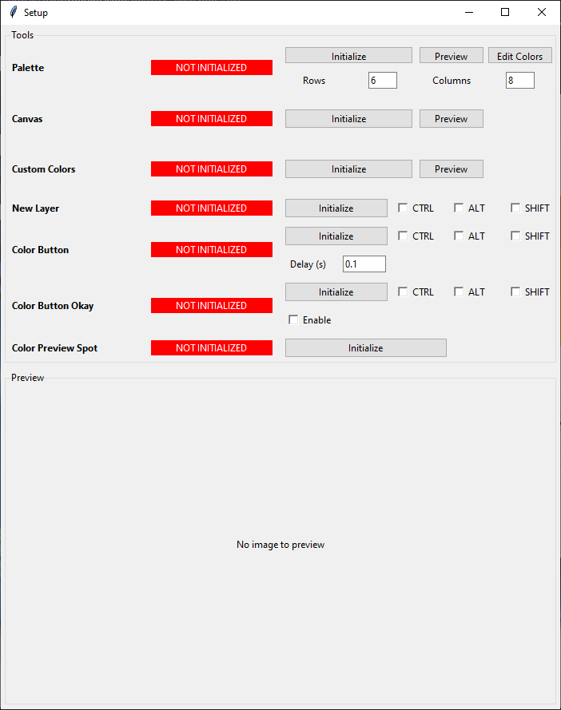

# Pyaint Usage Guide

Step-by-step instructions for using Pyaint effectively.

## Table of Contents

- [Getting Started](#getting-started)
- [Initial Setup](#initial-setup)
- [Basic Drawing](#basic-drawing)
- [Color Calibration](#color-calibration)
- [Region-Based Redrawing](#region-based-redrawing)
- [Advanced Features](#advanced-features)
- [File Management](#file-management)
- [Keyboard Controls](#keyboard-controls)
- [Tips and Best Practices](#tips-and-best-practices)

## Getting Started

### Installation

1. **Clone or download** repository
2. **Install dependencies**:
   ```bash
   pip install -r requirements.txt
   ```

3. **Run application**:
   ```bash
   python main.py
   ```

**Requirements:**
- Python 3.8 or higher
- Windows operating system
- Drawing application (MS Paint, Clip Studio Paint, etc.) running

## Initial Setup

When you first launch Pyaint, you'll see a main application window with three panels:



- **Control Panel** (left): Drawing settings and all action buttons
- **Image Preview Panel** (right): Image loading and display
- **Tooltip Panel** (bottom): Status messages and progress tracking

The File Management section is located in the Control Panel and provides configuration file management.

1. Click **"Setup"** button in Control Panel
2. A Setup Window will appear with tools configuration



### Initializing Tools

You need to initialize essential tools before drawing:

#### 1. Palette

The palette defines the available colors for drawing.

**Steps:**
1. Click **"Initialize"** next to Palette
2. Click on the **upper-left corner** of your palette in your drawing application
3. Click on the **lower-right corner** of your palette
4. The system will scan the palette and capture all colors
5. Status will change to **"INITIALIZED"** (green)

**Configuration Options:**
- **Rows/Columns**: Set the number of rows and columns in your palette grid
- **Valid Positions**: Toggle which palette cells are valid (advanced)
- **Manual Centers**: Pick exact center points for precision (advanced)
- **Auto-Estimate**: Quickly calculate center points (advanced)
- **Precision Estimate**: Maximum accuracy using reference points (advanced)

#### 2. Canvas

The canvas defines the drawing area.

**Steps:**
1. Click **"Initialize"** next to Canvas
2. Click on the **upper-left corner** of your canvas in your drawing application
3. Click on the **lower-right corner** of your canvas
4. Status will change to **"INITIALIZED"** (green)

#### 3. Custom Colors (Optional)

The custom colors feature enables unlimited color options.

**Steps:**
1. Click **"Initialize"** next to Custom Colors
2. Click on the **upper-left corner** of your custom colors area
3. Click on the **lower-right corner** of your custom colors area
4. Status will change to **"INITIALIZED"** (green)

**When to Use:**
- Your image has more colors than the palette provides
- You need precise color matching

#### 4. Color Preview Spot (Optional for Calibration)

Required for color calibration to capture RGB values.

**Steps:**
1. Click **"Initialize"** next to Color Preview Spot
2. Click on the **exact spot** where your selected color appears when using the custom colors spectrum
3. Status will change to **"INITIALIZED"** (green)

**When to Use:**
- When you want to run color calibration
- For improved color accuracy with custom colors

### Configuring Drawing Settings

In the Control Panel, adjust these settings:

| Setting | Range | Description | Recommended |
|----------|--------|-------------|--------------|
| Delay | 0.01-10.0s | Stroke timing | 0.1s |
| Pixel Size | 3-50 | Detail level | 12 |
| Precision | 0.0-1.0 | Color accuracy | 0.9 |
| Jump Delay | 0.0-2.0s | Cursor jump delay | 0.5s |
| Calibration Step | 1-10 | Pixel step for calibration | 2 |

**Tips:**
- Start with default values and adjust based on test results
- Higher precision = more accurate but slower
- Larger pixel size = less detail but faster drawing

### Drawing Modes

Choose your drawing mode from the dropdown:

- **Slotted**: Fast processing, simple color-to-lines mapping
- **Layered**: Better visual results with color frequency sorting (recommended)

### Drawing Options

Toggle these checkboxes as needed:

- **Ignore White Pixels**: Skip drawing white areas (useful for white canvas)
- **Use Custom Colors**: Enable advanced color mixing (requires Custom Colors tool)
- **Enable New Layer**: Automatically create new layers for each color
- **Enable Color Button**: Click color picker button before selecting colors
- **Enable Color Button Okay**: Click confirmation button after color selection
- **Enable MSPaint Mode**: Double-click on palette instead of single click (optional)
    - **MSPaint Mode checkbox**: Enable/disable double-click behavior
    - **MSPaint Mode delay**: Delay between double-clicks in seconds (default: 0.5)
- **Color Button delay entry**: Set delay after color button click (0.01-5.0s)
- **Color Button Okay enable checkbox**: Enable/disable clicking confirmation button
- **Color Button Okay delay entry**: Set delay after color button okay click (0.01-5.0s)

### File Management

The File Management section provides buttons to manage configuration files directly from the UI.

#### Remove Calibration

**Purpose:** Clear color calibration data to force recalibration or remove outdated data.

**What it Does:** Deletes `color_calibration.json` file and clears calibration data from memory.

**When to Use:**
- Color calibration data is outdated or incorrect
- You want to recalibrate from scratch
- Calibration was done on different display settings
- You're starting fresh

**Steps:**
1. Click **"Remove Calibration"** button in Control Panel
2. Confirm deletion in the dialog
3. Status message will confirm success or error

**After Deletion:**
- Bot will revert to keyboard input for custom colors
- Run **"Run Calibration"** again to rebuild calibration data

#### Reset Config

**Purpose:** Reset all settings, tools, and preferences to default values.

**What it Does:** Deletes `config.json` file to start fresh.

**What is Lost:**
- All tool configurations (Palette, Canvas, Custom Colors, etc.)
- All drawing settings (Delay, Pixel Size, Precision, Jump Delay)
- All feature toggles (New Layer, Color Button, MSPaint Mode, etc.)
- Pause key configuration
- Last used image URL

**When to Use:**
- Configuration is corrupted or causing issues
- You want to start completely fresh
- Settings are lost and need to reconfigure everything

**Steps:**
1. Click **"Reset Config"** button in Control Panel
2. Confirm deletion in the warning dialog
3. Status message will confirm success or error

**After Reset:**
- **Restart the application** to load default configurations
- Run **"Setup"** to reconfigure all tools
- Adjust drawing settings as needed
- Run **"Run Calibration"** if using custom colors

**Safety:**
- Both buttons include confirmation dialogs to prevent accidental data loss
- Check the status tooltip at the bottom of the window for detailed feedback

## Basic Drawing

### Loading an Image

1. **Enter a URL** in the Image Preview Panel
2. Click **"Search"** to load the image
3. OR click **"Open File"** to browse locally
4. The image will appear in the preview panel

**Supported Sources:**
- Local files (PNG, JPG, BMP, etc.)
- Remote URLs (direct image links)

### Pre-computation (Optional)

Pre-computing caches the image processing for faster subsequent runs.

**Steps:**
1. Load your image
2. Click **"Pre-compute"** button
3. Wait for processing to complete (progress will be shown)
4. Estimated drawing time will be displayed

**Benefits:**
- Instant drawing on subsequent runs
- Time estimation before drawing
- Useful for images you'll draw multiple times

### Test Drawing

Before a full drawing, test your brush settings:

#### Simple Test Draw

Quick 5-line calibration without color picking.

**Steps:**
1. Select your desired color in your painting application
2. Click **"Simple Test Draw"**
3. The bot will draw 5 horizontal lines at the canvas upper-left
4. Adjust your brush size in the painting application if needed

#### Test Draw

Detailed calibration with color switching.

**Steps:**
1. Click **"Test Draw"**
2. The bot will draw the first 20 lines with color changes
3. Observe the output to verify:
   - Colors are correct
   - Lines are drawn smoothly
   - Timing is appropriate

**Use For:**
- Verifying brush size settings
- Testing color selection accuracy
- Checking jump delay effectiveness

### Full Drawing

1. Click **"Start"** button
2. A warning dialog will appear (ESC and pause key info)
3. Click "OK" to continue
4. The application will minimize
5. Drawing will begin with progress updates

**During Drawing:**
- Progress percentage displays in Tooltip Panel
- Current color and stroke count shown
- Time remaining estimate updates

**Controls:**
- **ESC**: Stop drawing immediately
- **Pause Key** (default 'p'): Pause/resume drawing
- Press pause key again to resume

## Color Calibration

Color calibration improves accuracy when using custom colors by creating a precise mapping of RGB values to spectrum positions.

### When to Use

- You want the most accurate colors possible
- Your custom colors spectrum is complex
- You're drawing multiple times with the same colors

### Requirements

- Custom Colors tool initialized
- Color Preview Spot tool initialized
- Calibration Step Size configured

### Running Calibration

**Steps:**
1. Configure Custom Colors tool (spectrum area)
2. Configure Color Preview Spot tool (preview location)
3. Set **Calibration Step Size** (1-10, default: 2):
   - Lower = more accurate but slower
   - Higher = faster but less accurate
4. Click **"Run Calibration"** button
5. Wait for calibration to complete
6. Calibration data saved to `color_calibration.json`

**What Happens During Calibration:**
1. Bot presses mouse down at spectrum start
2. Bot drags through entire spectrum
3. At each step, captures RGB value from Preview Spot
4. Creates mapping: RGB → (x, y) coordinates
5. Releases mouse up

### Using Calibrated Colors

During drawing:
1. Bot first checks calibration map for exact match
2. If match within tolerance: Uses calibrated position
3. If no match: Falls back to nearest spectrum color
4. Calibration data is automatically loaded if `color_calibration.json` exists

## Region-Based Redrawing

Redraw only a specific area of an image without reprocessing the entire image.

### Use Cases

- **Fixing mistakes**: Redraw only the area with errors
- **Adding details**: Add new elements to existing drawing
- **Selective updates**: Modify specific regions without affecting others

### Steps

1. Load your image
2. Click and drag on the image preview to select a region
3. Click **"Redraw Region"** button
4. Only the selected area will be drawn

**Selection:**
- Click upper-left corner, drag to lower-right corner
- Selected region will be highlighted

## Advanced Features

### New Layer Automation

Automatically create a new layer in your drawing application for each color.

**Setup:**
1. Click **"Setup"** → Click **"Initialize"** next to New Layer
2. Click the new layer button location in your application
3. Configure modifier keys if needed (CTRL, ALT, SHIFT)
4. Enable **"Enable New Layer"** checkbox in Control Panel

**Behavior:**
- Before each color change, bot clicks the new layer button
- Modifier keys are held during the click
- Waits 0.75 seconds after the click to ensure the layer is ready

### Color Button Automation

Automatically click a color picker button to access custom colors.

**Setup:**
1. Click **"Setup"** → Click **"Initialize"** next to Color Button
2. Click the color picker button location in your application
3. Configure the delay (time to wait after click)
4. Configure modifier keys if needed (CTRL, ALT, SHIFT)
5. Enable **"Enable Color Button"** checkbox in Control Panel

**Behavior:**
- Before each color change, bot clicks the color button
- Waits the configured delay for the color picker to open
- Selects color from spectrum or uses keyboard input

### Color Button Okay

Optional confirmation click after color selection.

**Setup:**
1. Click **"Setup"** → Click **"Initialize"** next to Color Button Okay
2. Click the confirmation button location in your application
3. Configure modifier keys if needed (CTRL, ALT, SHIFT)
4. Enable **"Enable"** checkbox in Control Panel

**Behavior:**
- After color selection, clicks the confirmation button
- Waits the configured delay before drawing

## Keyboard Controls

### Pause Key

**Default:** 'p'

**Setting:**
1. Click in the **Pause Key** entry field in Control Panel
2. Press any key (a-z, 0-9, function keys)
3. The key name will be saved

**Behavior:**
- Press pause key during drawing: Toggle pause/resume
- Press pause key when not drawing: Set as new pause key

### ESC Key

Global hotkey for emergency stop.

**Behavior:**
- Pressing ESC during drawing: Stops immediately
- Pressing ESC during test: Stops test
- Pressing ESC during setup: Cancels operation
- Pressing ESC during calibration: Stops calibration

## Tips and Best Practices

### Performance Optimization

1. **Use Pre-compute** for images you'll draw multiple times
2. **Adjust Pixel Size** based on desired detail vs. speed
3. **Enable "Ignore White Pixels"** for images with large white areas
4. **Use Layered Mode** for better visual results on complex images
5. **Fine-tune Jump Delay** to prevent unintended strokes

### Palette Setup Tips

1. **Use Auto-Estimate** for quick initial setup on regular grids
2. **Use Precision Estimate** for maximum accuracy on irregular palettes
3. **Toggle Invalid Positions** to exclude broken or unused colors
4. **Preview captured regions** to verify correct configuration
5. **For Precision Estimate with multiple rows**, ensure you have at least 2 valid rows

### Color Calibration Tips

1. **Set appropriate step size**: Lower = more accurate, Higher = faster
2. **Verify Preview Spot**: Ensure it shows the exact selected color
3. **Check Spectrum Box**: Must cover the entire color spectrum
4. **Test calibration** with a test draw before starting full drawing
5. **Reuse calibration**: Data saved to file can be used across sessions

### Color Button Tips

1. **Set appropriate delay** for your application's color picker opening time
2. **Use modifier keys** if your application requires them to access the color picker
3. **Enable "Color Button Okay"** if your application requires clicking a confirmation button
4. **Test color button configuration** with a simple test draw before starting a full drawing

### Drawing Workflow

1. **Load image** → **(Optional) Pre-compute** → **Test Draw** → **Start**
2. **Monitor progress** via the tooltip panel
3. **Use pause/resume** to interrupt if needed
4. **ESC to stop** if something goes wrong

### File Management Section


The File Management section provides two buttons for managing configuration files directly from the UI:

#### Remove Calibration Button

**Purpose:** Clear color calibration data to force recalibration or remove outdated data.

**What it Does:**
- Deletes `color_calibration.json` file
- Resets bot's calibration map in memory

**When to Use:**
- Calibration data is outdated or incorrect
- You want to recalibrate from scratch
- Calibration was done on different display settings

**Safety:** Confirmation dialog prevents accidental deletion

#### Reset Config Button

**Purpose:** Reset all settings, tools, and preferences to default values.

**What it Does:**
- Deletes `config.json` file
- ALL settings are reset to application defaults

**What is Lost:**
- All tool configurations (Palette, Canvas, Custom Colors, etc.)
- All drawing settings (Delay, Pixel Size, Precision, Jump Delay)
- All feature toggles (New Layer, Color Button, MSPaint Mode, etc.)
- Pause key configuration
- Last used image URL

**When to Use:**
- Configuration is corrupted or causing issues
- You want to start completely fresh
- Settings are lost and need to reconfigure everything

**Safety:** Warning dialog alerts you that all data will be lost

### Troubleshooting

If you encounter issues:

1. **Drawing not starting**: Ensure palette and canvas are initialized
2. **Colors incorrect**: Check custom colors setup and precision settings
3. **Slow performance**: Reduce pixel size or increase delay settings
4. **Application not responding**: Use ESC to stop and restart

For detailed troubleshooting, see [Troubleshooting Guide](./troubleshooting.md).

## See Also

- [README.md](../README.md)
- [API Reference](./api.md)
- [Configuration Guide](./configuration.md)
- [Architecture](./architecture.md)
- [Troubleshooting](./troubleshooting.md)
